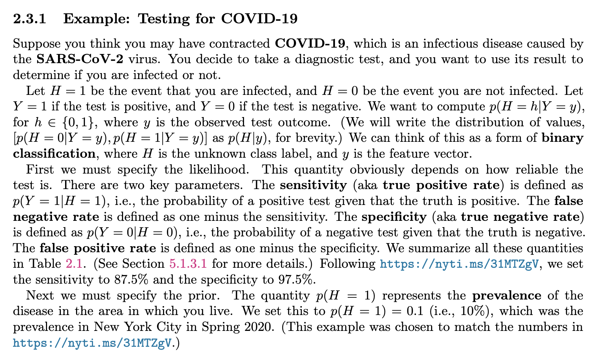
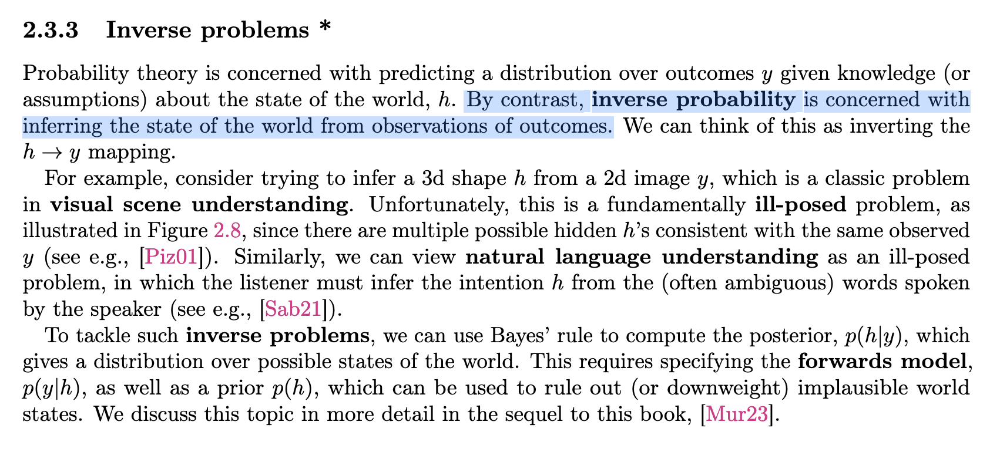

---
jupyter:
  jupytext:
    formats: ipynb,md
    text_representation:
      extension: .md
      format_name: markdown
      format_version: '1.3'
      jupytext_version: 1.14.4
  kernelspec:
    display_name: Python 3 (ipykernel)
    language: python
    name: python3
---

<!-- #region slideshow={"slide_type": "slide"} -->
# State Space Model Book Club
<!-- #endregion -->

```python slideshow={"slide_type": "skip"}
import numpy as np
import pymc as pm
import arviz as az
import pandas as pd
import preliz as pz

import matplotlib.pyplot as plt
```

<!-- #region slideshow={"slide_type": "slide"} -->
## Agenda
<!-- #endregion -->

Three notebooks
1. Bayesian Basics (This one)
2. Notation
3. State Space Model Basics

<!-- #region slideshow={"slide_type": "slide"} -->
## Bayes Formula
<!-- #endregion -->

$$ \underbrace{p(\boldsymbol{\theta} \mid \boldsymbol{Y})}_{\text{posterior}} = \frac{\overbrace{p(\boldsymbol{Y} \mid \boldsymbol{\theta})}^{\text{likelihood}}; \overbrace{p(\boldsymbol{\theta})}^{\text{prior}}}{\underbrace{{{\int_{\boldsymbol{\Theta}} p(\boldsymbol{Y} \mid \boldsymbol{\theta})p(\boldsymbol{\theta}) d\boldsymbol{\theta}}}}_{\text{marginal likelihood}}} $$

<!-- #region slideshow={"slide_type": "slide"} -->
## Bayesian Update Intuition
<!-- #endregion -->

Much simpler than the formula

<!-- #region slideshow={"slide_type": "fragment"} -->
1. You have some prior belief
  * It may be opinionated/informmed
  * It may not
<!-- #endregion -->

<!-- #region slideshow={"slide_type": "fragment"} -->
2. You get some data

<!-- #endregion -->

<!-- #region slideshow={"slide_type": "fragment"} -->
3. You update your beliefs
<!-- #endregion -->

<!-- #region slideshow={"slide_type": "slide"} -->
## Simplified Bayes Formula
<!-- #endregion -->

$$
\text{Posterior} = \frac{\text{Likelihood}  * \text{Prior}}{\text{Marginal-Likelihood}}
$$


* **Prior** - Your beliefs prior to seeing the data
* **Likelihood** - How believable the data is given a set of model parameters
* **Posterior** - Your beliefs after combining the two

* **Marginal Likelihood** - A term you need to calculate proper probabilities but in practice you largely ignore

<!-- #region slideshow={"slide_type": "slide"} -->
## The typical problems Bayes 101 problems
<!-- #endregion -->

* Coin Flips
* COVID 
* Monty Hall Problem

<!-- #region slideshow={"slide_type": "slide"} -->
## Example from ProbML
<!-- #endregion -->

<!-- #region slideshow={"slide_type": "-"} -->
<center>
  
</center>
<!-- #endregion -->

<!-- #region slideshow={"slide_type": "slide"} -->
## Covid Prevalance
<!-- #endregion -->

$$
P(SF) = \text{10%} \\
P(\text{~}SF) = \text{90%}
$$

<!-- #region slideshow={"slide_type": "slide"} -->
## Likelihood of positive test
<!-- #endregion -->

$$
P(PT | SF) = \text{Chance of a positive test given the person has space-flu.} \\
P(PT | \text{~}SF) = \text{Chance of a positive test given the person doesn’t have space flu.}
$$

<!-- #region slideshow={"slide_type": "fragment"} -->
$$
P(PT \mid SF) = \text{90%} \\
P(PT \mid \text{~}SF) = \text{20%}
$$
<!-- #endregion -->

<!-- #region slideshow={"slide_type": "slide"} -->
## Covid in code
<!-- #endregion -->

```python slideshow={"slide_type": "fragment"}
prior = [.1, .9]  # P(SF), P(~SF)
likelihood = [.9, .2]  # P(PT | SF), p(PT | ~SF)
```

```python slideshow={"slide_type": "fragment"}
unnormalized_posterior = [None, None]
unnormalized_posterior[0] = likelihood[0]*prior[0]
unnormalized_posterior[1] = likelihood[1]*prior[1]
```

```python slideshow={"slide_type": "fragment"}
marginal_likelihood = likelihood[0]*prior[0] + likelihood[1]*prior[1]
```

```python slideshow={"slide_type": "fragment"}
posterior = [None, None]
posterior[0] = unnormalized_posterior[0] / marginal_likelihood
posterior[1] = unnormalized_posterior[1] / marginal_likelihood  
posterior
```

<!-- #region slideshow={"slide_type": "slide"} -->
## COVID Example Visualized
<!-- #endregion -->

```python hide_input=true
from IPython.display import HTML, IFrame

HTML('<iframe width="1280" height="720" src="https://www.youtube.com/embed/dUlakTE8u7E" title="Bayes Theorem Visualized" frameborder="0" allow="accelerometer; autoplay; clipboard-write; encrypted-media; gyroscope; picture-in-picture; web-share" allowfullscreen></iframe>')
```

<!-- #region slideshow={"slide_type": "skip"} -->
## Inverse Problems
<!-- #endregion -->

<!-- #region slideshow={"slide_type": "slide"} -->
<center>
  
</center>
<!-- #endregion -->

<!-- #region slideshow={"slide_type": "slide"} -->
## We see something, what do we learn?
Not, we know something (probability values) what is the probability of some subevent occurring?
<!-- #endregion -->

<!-- #region slideshow={"slide_type": "slide"} -->
## User Conversion Probability on a website?
<!-- #endregion -->

* A 100 visitors visit us
* 8 Convert

What do we believe about unobservable conversion rate?

<!-- #region slideshow={"slide_type": "slide"} -->
## What are **possible conversion rates**?
<!-- #endregion -->

Possible conversion rates

* 0%
* 8%
* 20%
* 31%
* 88%
* 99%

<!-- #region slideshow={"slide_type": "fragment"} -->
Anything between 0% and 1 % is possible
<!-- #endregion -->

<!-- #region slideshow={"slide_type": "slide"} -->
## What is the plausibility of the conversion rates?
<!-- #endregion -->

<!-- #region slideshow={"slide_type": "fragment"} -->
### Lets start with priors
<!-- #endregion -->

```python
pz.Beta(1, 1).plot_pdf(figsize=(20,8));
```

<!-- #region slideshow={"slide_type": "slide"} -->
## Bayesian Update
<!-- #endregion -->

```python
num_conversions = 8
num_non_conversions = 100 - num_conversions

# The bayesian update is happening right here
pz.Beta(1+num_conversions, 1+num_non_conversions).plot_pdf();
```

<!-- #region slideshow={"slide_type": "notes"} -->
Made possible through "pen and paper" mathematics and people that are smart at math
<!-- #endregion -->

<!-- #region slideshow={"slide_type": "slide"} -->
## Relative Plausibility of all possible beliefs
<!-- #endregion -->

```python
num_conversions = 8
num_visits = 100
num_non_conversions = num_visits - num_conversions
pz.Beta(2+8, 2+num_non_conversions).plot_pdf();
```

<!-- #region slideshow={"slide_type": "slide"} -->
## Bayesian Update with a PPL
<!-- #endregion -->

```python
with pm.Model() as model:
    θ = pm.Beta("θ", 1, 1)
    y = pm.Binomial("y", n=num_visits, p=θ, observed=num_conversions)
    trace = pm.sample()
```
```python slideshow={"slide_type": "-"}
az.plot_trace(trace);
```

Made possible through computers and other people who are smart at math

<!-- #region slideshow={"slide_type": "slide"} -->
## What's the difference

<!-- #endregion -->

<!-- #region slideshow={"slide_type": "fragment"} -->
* Conjugate Model - Pure "pen on paper math"
  * No computer needed
  * Exact
  * Very restricted to specific prior likelihood combinations
<!-- #endregion -->

<!-- #region slideshow={"slide_type": "fragment"} -->
* Markov Chain Monte Carlo algorithms
  * Not very practical without computers
  * Enables 
  * Generally applicable
<!-- #endregion -->

<!-- #region slideshow={"slide_type": "slide"} -->
## Relation to this book club
<!-- #endregion -->

* Various SSMs have "pen and paper" solutions
* With tools like Dynamax different and more complex models may be solvable
  * Dynamax supports MCMC through blackjax so we might see this ater

<!-- #region slideshow={"slide_type": "fragment"} -->
We want to learn both the traditional techniques **and** what newer tools like JAX and Dynamax let us solve
<!-- #endregion -->

<!-- #region slideshow={"slide_type": "slide"} -->
## Bayesian Linear Regression of Penguins
<!-- #endregion -->

```python
penguins_url = "https://gist.githubusercontent.com/slopp/ce3b90b9168f2f921784de84fa445651/raw/4ecf3041f0ed4913e7c230758733948bc561f434/penguins.csv"
penguins = pd.read_csv(penguins_url)
# Subset to the columns needed
missing_data = penguins.isnull()[
    ["bill_length_mm", "flipper_length_mm", "sex", "body_mass_g"]
].any(axis=1)
# Drop rows with any missing data
penguins = penguins.loc[~missing_data]

adelie_mask = (penguins["species"] == "Adelie")
adelie_mass_obs = penguins.loc[adelie_mask, "body_mass_g"].values
adelie_flipper_length_obs = penguins.loc[adelie_mask, "flipper_length_mm"]

```

<!-- #region slideshow={"slide_type": "slide"} -->
## Make a plot
<!-- #endregion -->

```python
fig, ax = plt.subplots()


ax.scatter(adelie_flipper_length_obs, adelie_mass_obs)
ax.set_xlabel('Flipper Length')
ax.set_ylabel('Mass');
```

<!-- #region slideshow={"slide_type": "slide"} -->
## Bayesian Regression
<!-- #endregion -->

```python

with pm.Model() as model_adelie_flipper_regression:
    # pm.Data allows us to change the underlying value in a later code block
    adelie_flipper_length = pm.Data("adelie_flipper_length",
                                    adelie_flipper_length_obs)
    σ = pm.HalfStudentT("σ", 100, 2000)
    β_0 = pm.Normal("β_0", 0, 4000)
    β_1 = pm.Normal("β_1", 0, 4000)
    μ = pm.Deterministic("μ", β_0 + β_1 * adelie_flipper_length)

    mass = pm.Normal("mass", mu=μ, sigma=σ, observed = adelie_mass_obs)

    inf_data_adelie_flipper_regression = pm.sample(return_inferencedata=True)

```

<!-- #region slideshow={"slide_type": "slide"} -->
## Regression with Uncertainty bounds
<!-- #endregion -->

```python
fig, ax = plt.subplots()
alpha_m = inf_data_adelie_flipper_regression.posterior.mean().to_dict()["data_vars"]["β_0"]["data"]
beta_m = inf_data_adelie_flipper_regression.posterior.mean().to_dict()["data_vars"]["β_1"]["data"]

flipper_length = np.linspace(adelie_flipper_length_obs.min(), adelie_flipper_length_obs.max(), 100)

flipper_length_mean = alpha_m + beta_m * flipper_length
ax.plot(flipper_length, flipper_length_mean, c='g', lw=4,
         label=f'y = {alpha_m:.2f} + {beta_m:.2f} * x')

ax.scatter(adelie_flipper_length_obs, adelie_mass_obs)

# Figure out how to do this from inference data
az.plot_hdi(adelie_flipper_length_obs, inf_data_adelie_flipper_regression.posterior['μ'], hdi_prob=0.94, color='k', ax=ax)

ax.set_xlabel('Flipper Length')
ax.set_ylabel('Mass');
```

<!-- #region slideshow={"slide_type": "slide"} -->
## Dynamax Book Club Takeaway
<!-- #endregion -->

* Bayes theorem is a philosophy for how we can update our beliefs given observations
* ProbML calls outcome -> belief mapping inverse probability
* What we care about is the relative plausibiilty
* For the same model there can be different estimators
  * Each as their tradeoffs
  * Computer enables newer ones not possible in the past
