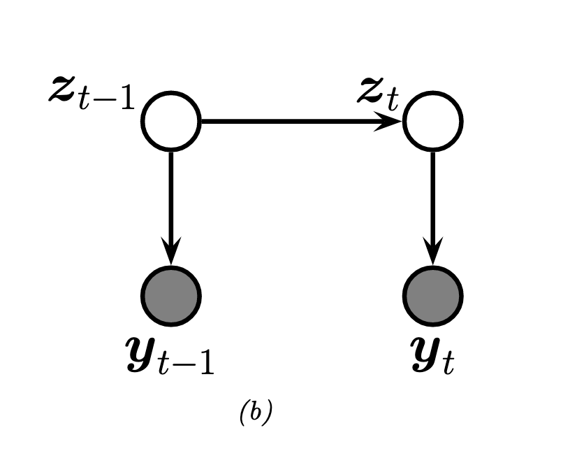

---
jupyter:
  jupytext:
    formats: ipynb,md
    text_representation:
      extension: .md
      format_name: markdown
      format_version: '1.3'
      jupytext_version: 1.14.4
  kernelspec:
    display_name: Python 3 (ipykernel)
    language: python
    name: python3
---

<!-- #region slideshow={"slide_type": "slide"} -->
# State Space Models
<!-- #endregion -->

<!-- #region slideshow={"slide_type": "slide"} -->
## Two Parts
<!-- #endregion -->

<!-- #region slideshow={"slide_type": "fragment"} -->
1. State
<!-- #endregion -->

<!-- #region slideshow={"slide_type": "fragment"} -->
2. Space
<!-- #endregion -->

<!-- #region slideshow={"slide_type": "skip"} -->
* State - The hidden thing we can't observe
  * Also called transition model
* Space - Where we see outcomes
  *  or emissions
<!-- #endregion -->

<!-- #region slideshow={"slide_type": "slide"} -->
## Simplified State Space Model
<!-- #endregion -->

$$
\begin{align}
p(y_{1:T}, z_{1:T} \mid \theta) 
&= \mathrm{Cat}(z_1 \mid \pi) 
\prod_{t=2}^T \mathrm{Cat}(z_t \mid A_{z_{t-1}}) 
\prod_{t=1}^T \mathrm{Cat}(y_t \mid B_{z_t})
\end{align}
$$

<!-- #region slideshow={"slide_type": "slide"} -->
## Parts of the equation
<!-- #endregion -->

$$
\begin{align}
p(y_{1:T}, z_{1:T} \mid \theta) 
&= \overbrace{\mathrm{Cat}(z_1 \mid \pi)}^{Prior for Initial State}
\prod_{t=2}^T \mathrm{Cat}(z_t \mid A_{z_{t-1}})
\prod_{t=1}^T \mathrm{Cat}(y_t \mid B_{z_t})
\end{align}
$$

<!-- #region slideshow={"slide_type": "slide"} -->
## Parts of the equation
<!-- #endregion -->

$$
\begin{align}
p(y_{1:T}, z_{1:T} \mid \theta) 
&= \overbrace{\mathrm{Cat}(z_1 \mid \pi)}^{Prior for Initial State}
\underbrace{\prod_{t=2}^T \mathrm{Cat}(z_t \mid A_{z_{t-1}})}_{Transition Model}
\prod_{t=1}^T \mathrm{Cat}(y_t \mid B_{z_t})
\end{align}
$$

Transmission model or dynamics model

<!-- #region slideshow={"slide_type": "slide"} -->
## Parts of the equation
<!-- #endregion -->

$$
\begin{align}
p(y_{1:T}, z_{1:T} \mid \theta) 
&= \overbrace{\mathrm{Cat}(z_1 \mid \pi)}^{Prior for Initial State}
\underbrace{\prod_{t=2}^T \mathrm{Cat}(z_t \mid A_{z_{t-1}})}_{Transition Model}
\overbrace{\prod_{t=1}^T \mathrm{Cat}(y_t \mid B_{z_t})}^{Observation Model}
\end{align}
$$

Observation model or emissions model

<!-- #region slideshow={"slide_type": "slide"} -->
## Hidden Markov Model Notation
$$
\begin{align}
p(y_{1:T}, z_{1:T} \mid \theta) 
&= \overbrace{\mathrm{Cat}(z_1 \mid \pi)}^{Prior for Initial State}
\underbrace{\prod_{t=2}^T \mathrm{Cat}(z_t \mid A_{z_{t-1}})}_{Transition Model}
\overbrace{\prod_{t=1}^T \mathrm{Cat}(y_t \mid B_{z_t})}^{Observation Model}
\end{align}
$$

<!-- #endregion -->

$$\theta = (\pi, A, B)$$

$$A - \text{Transition Matrix}$$
$$B - \text{Emission Probability}$$
$$\pi - \text{Initial Probability}$$

<!-- #region slideshow={"slide_type": "slide"} -->
## State Space Sequence

  

<!-- #endregion -->

<!-- #region slideshow={"slide_type": "slide"} -->
## Dishonest Casino
<!-- #endregion -->

  

<!-- #region slideshow={"slide_type": "slide"} -->
## Dishonest Casino Setup
<!-- #endregion -->

The dealer has two dice
* One dice is fair
* One dice is biased
* The dealer swaps the dice at random
  * **Does not mean uniform random**

<!-- #region slideshow={"slide_type": "slide"} -->
## Dishonest Casino HMM Questions
<!-- #endregion -->

* How can we tell which dice is in use based on the outcomes?
  * While were watching live (online filtering)
  * A replay after the fact (offline smoothing)
* What will the next dice rolls be? (Future observations forecasting/prediction)
* what will the next dice dice in use?(Future state forecasting/prediction)

<!-- #region slideshow={"slide_type": "slide"} -->
## HMM questions generalized
<!-- #endregion -->

If we see a bunch of outcomes can we
* What will happen?
    * Estimate what state we are in, or were in, or will be in
    * Estimate what we will see next
    
* What's the underlying truth of the world?
    * Estimate the transition matrix parameters
    * Estimate the emission model parameter
    * Estimate model the starting point

<!-- #region slideshow={"slide_type": "slide"} -->
## State Space Model Recap
<!-- #endregion -->

* State and Space are primary terms
* There are other equally valid terms terms like
  * Emissions
  * Observation
  * Transition
  * Dynamics

* In using SSMs we may be more interested in
  * The hidden system state
    * Either what's next or what's to come
    * After the fact or during the sequencing process
  * What we well see next for observations
  * EStimating the model parameters
* We're starting with discrete HMM
  * No autoregressive dependency
  * No covariate
  * Discrete states

<!-- #region slideshow={"slide_type": "slide"} -->
## Reading Next Time
Full post on Discourse

* Casino HMMs from Dynamax
* Complete reading of https://nipunbatra.github.io/hmm/
* Filtering (forwards algorithm)
* Smoothing (forwards-backwards algorithm)
* Most likely state sequence (Viterbi algorithm)
<!-- #endregion -->
